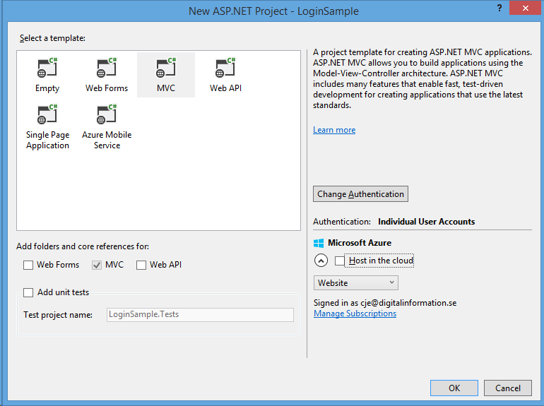

# Part 3 Number verification and ASP.NET identity and Two factor Auth. 
In this part of the tutorial series we are going to create an SMS provider for Microsoft Identity that comes shiped with in the .net framework in about 15 minutes.

## Prerequisites 
1. Good understanding of C# and REST APIs
2. Visual Studio 2013 or later
3. An account with Sinch [http://sinch.com/signup](http://sinch.com/signup)

## Setup
1. Create a new a project and name it LoginSample
2. Select MVC project with basic Authentication


## Enable SMS for two factor Auth with Sinch
1. In the package manager console
`Install-Package Sinch.SMS`
2. Open **IdentityConfig.cs** file in **App_Start** folder and find the **SMSService** class and add the Sinch implemenation to to it
```csharp
public Task SendAsync(IdentityMessage message)
{
    Sinch.SMS.Client client = new Client("key", "secret");
    return client.SendSMS(message.Destination, message.Body);
}
```
replace key and secret with your own info from the [dashboard](http://sinc.com/dashboard)
## Update the profile page to show number
In a production scenario you would probably ask for phonenumber during registration, but in this case we will just add it to the profile page. 
1. Open **Views\Manage\Index.cshtml**
Find the PhoneNumber section and uncomment it
```html
  <dt>Phone Number:</dt>
    <dd>
        @(Model.PhoneNumber ?? "None") [
        @if (Model.PhoneNumber != null)
        {
            @Html.ActionLink("Change", "AddPhoneNumber")
            @: &nbsp;|&nbsp;
            @Html.ActionLink("Remove", "RemovePhoneNumber")
        }
        else
        {
            @Html.ActionLink("Add", "AddPhoneNumber")
        }
        ]
    </dd>
``` 
2. Also uncomment the two factor auth part
```csharp
 @if (Model.TwoFactor)
{
    using (Html.BeginForm("DisableTwoFactorAuthentication", "Manage", FormMethod.Post, new { @class = "form-horizontal", role = "form" }))
    {
        @Html.AntiForgeryToken()
        <text>Enabled
        <input type="submit" value="Disable" class="btn btn-link" />
        </text>
    }
}
else
{
    using (Html.BeginForm("EnableTwoFactorAuthentication", "Manage", FormMethod.Post, new { @class = "form-horizontal", role = "form" }))
    {
        @Html.AntiForgeryToken()
        <text>Disabled
        <input type="submit" value="Enable" class="btn btn-link" />
        </text>
    }
}
```

#Testing the app
Hit **F5** and run the app, if you havent already register an account and click on the user name in the top right corner. This will take you to the manage profile page.

1. Click add phonenumber (remember to enter it in international format i.e **1**5612600684)
2. Enter the code you recieve in an SMS
3. Click enable to factor auth, and log off and log in again you should now see the below.

4. Click next and and enter the code in the next window.


This tutorial showed you how easy it is to enable two factor auth on an ASP.net Identity application using sinch. 


